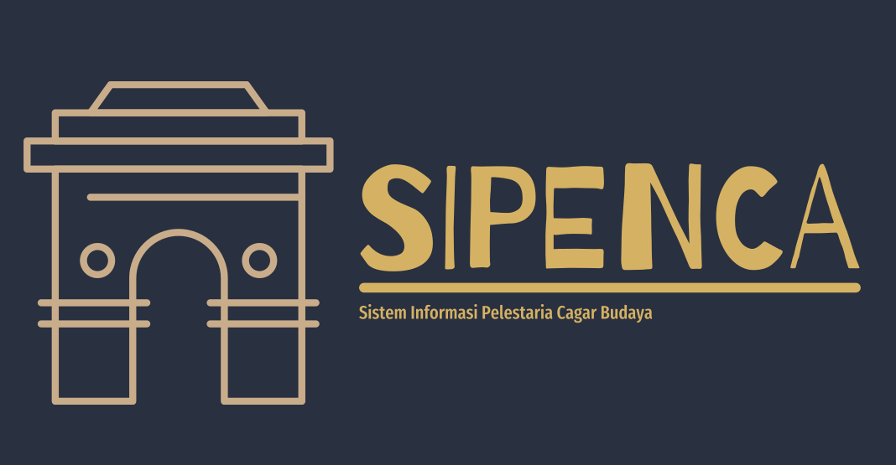

**SIPENCA (Sistem Informasi Pelestarian dan Eksplorasi Cagar Budaya Sleman)**

***Deskripsi**

SIPENCA merupakan sebuah platform inovatif yang bertujuan untuk memfasilitasi pelestarian dan eksplorasi cagar budaya di Kabupaten Sleman. Dibangun dengan memanfaatkan data dari Geoportal Sleman dan Dinas Kebudayaan, SIPENCA menyediakan akses mudah dan interaktif ke informasi mengenai kekayaan budaya di wilayah tersebut. Platform ini menggunakan teknologi Web GIS untuk menyajikan data secara visual dan memberikan kontribusi dalam manajemen cagar budaya secara efisien.

***Fitur Utama**

SIPENCA menyajikan peta interaktif yang memungkinkan pengguna menjelajahi lokasi cagar budaya di Kabupaten Sleman.
Integrasi dengan Geoportal Sleman untuk menyediakan data geografis terkini.

Platform ini mjugs emberikan informasimengenai cagar budaya. SIPENCA mendukung eksplorasi kekayaan budaya dengan menyajikan galeri gambar yang memperkaya pengalaman pengguna.
Integrasi data dari Dinas Kebudayaan untuk informasi lebih lanjut tentang kegiatan budaya dan acara terkait.

***Sumber Data**

SIPENCA mengambil beberapa data dari Geoportal Kabupaten Sleman dan data Dinas Kebudayaan.

Mari lestarikan dan eksplorasi cagar budaya di Sleman melalui SIPENCA!# webgis-sipenca
